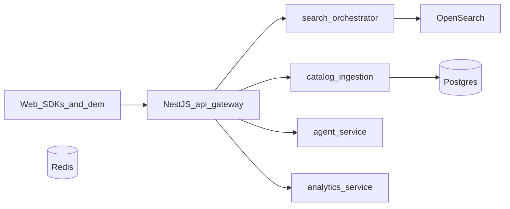

# Commerce AI — technical PRD (Milestone 0 scaffold + Milestone 1 specification)

This document is the product-facing source of truth for scope and acceptance tests. The machine-readable API contract lives in [`contracts/openapi.yaml`](contracts/openapi.yaml).

**Formal documentation hub:** structured architecture, security, requirements (TRD), and GTM/integration narrative — [`docs/README.md`](docs/README.md).

## Product summary

**Commerce AI** is a multi-tenant hybrid commerce search platform (lexical + vector, with faceting and business filters), an **agent API** on top of the same retrieval core, and **SDK packages** for integrators. The NestJS **api-gateway** is the public edge; FastAPI services own orchestration, ingestion, workers, analytics, and the agent.

## Architecture (runtime)

## Core abstractions

- **`SearchEngineAdapter`** (Python): `ping`, `hybrid_search`, `index_bulk`, `delete_by_tenant`, `facet_aggs`. v1 implementation: **OpenSearch** (`OpenSearchAdapter`). Future: Vespa / Qdrant adapters behind the same interface.
- **Canonical product document**: bilingual `title` / `description` / `search_text`, structured `attrs`, `pricing` by market, optional `embedding` (768-dim in template), `tenant_id` on every document.
- **Tenant isolation**: shared physical index with mandatory `tenant_id` filter (see [`configs/opensearch/commerce-products-index-template.json`](configs/opensearch/commerce-products-index-template.json)).

## PostgreSQL (target schema, Milestone 1–2)

Minimum tables to plan migrations against:

- `tenants`, `api_keys` (hashed secret), optional `users` for admin login
- `feed_sources`, `feed_mappings` (JSON), `index_jobs` (status, error payload)
- `tenant_search_config` (lexical_weight, semantic_weight, rerank_top_k, default_market)
- `search_events` (or dedicated analytics store) — impressions, clicks, zero-results

## Relevance formula (design target)

Tunable per tenant; initial weights documented for tuning only (not marketed without benchmarks):

`final_score ≈ w_lex × lexical + w_sem × semantic + w_rr × reranker + w_pop × popularity + w_biz × business_rules`

Scaffold exposes `lexicalWeight` / `semanticWeight` in search `context` for experiments; rerank and learning-to-rank land in Milestone 2–3.

## Multilingual (English + Arabic)

- Separate analyzed `search_text.en` vs `search_text.ar` fields (Arabic analyzer in template).
- **Single multilingual embedding** per SKU (combined snippet) preferred for cost; document final model choice in infra env (`EMBEDDING_MODEL`).
- Hybrid retrieval merges lexical exactness with semantic fuzzy intent once query embeddings land (Milestone 1+).

## Performance targets (engineering goals, not marketing claims)

- Autocomplete p95: 80–150 ms (after proper completion index)
- Search p95: 150–400 ms
- Agent with search grounding p95: 700–1800 ms
- Incremental feed freshness: under 5 minutes end-to-end

Benchmarks required before publishing SLAs.

---

## Milestone 0 — acceptance (scaffold) — **DONE**

- [x] Monorepo layout: `apps/`, `packages/`, `services/`, `contracts/`, `configs/opensearch/`, `infra/docker/`
- [x] `docker-compose` for OpenSearch, Postgres, Redis, MinIO ([`infra/docker/docker-compose.yml`](infra/docker/docker-compose.yml))
- [x] NestJS gateway with API-key stub, dev-mode bypass, route proxy to FastAPI URLs ([`services/api-gateway`](services/api-gateway))
- [x] FastAPI services: search-orchestrator, catalog-ingestion, embedding-worker, indexing-worker, analytics-service, agent-service + shared settings ([`services/shared-python`](services/shared-python))
- [x] OpenAPI 3.1 contract ([`contracts/openapi.yaml`](contracts/openapi.yaml))
- [x] `SearchEngineAdapter` + `OpenSearchAdapter` skeleton + index template JSON
- [x] Storefront demo page calling `POST /v1/search` via gateway ([`apps/storefront-demo`](apps/storefront-demo))
- [x] SDK stubs: `@commerce-ai/search-js`, `@commerce-ai/search-react`, `@commerce-ai/ui-components`

## Milestone 1 — acceptance (next implementation pass)

1. **CSV → canonical schema**  
   - Parse merchant CSV (columns aligned to plan: `id`, `SKU (Part Number)`, bilingual `Name` / `Long Description`, `Composition`, `Image Links`, price columns e.g. `price.ae` / `price.sa`, barcodes, color, size, origin, etc.).  
   - Map to canonical JSON (see plan in chat / `product_id`, `sku`, `title.{en,ar}`, `description.{en,ar}`, `attrs`, `pricing`, `images`, `search_text`, `market`).

2. **Ingestion pipeline**  
   - `POST /v1/admin/feeds/presign` + direct **PUT to MinIO**, then `POST /v1/admin/feeds/import` enqueues a Postgres + Redis job (`index_jobs`).  
   - **Embedded worker thread** (catalog-ingestion process) streams **`*.csv.gz`** and bulk-indexes OpenSearch in batches (`ingest_batch_size`, default 2500).  
   - Set `EMBEDDED_INGEST_WORKER=false` to run **`commerce-ingest-worker`** as a standalone process instead.

3. **Hybrid search API**  
   - `POST /v1/search`: deterministic filter extraction **v0 shipped** (`query_parse`), **facet aggregations** (colors, markets), **price range filters** wired to nested `pricing.*`, **match_all when query empty**.  
   - Remaining optional: cross-lingual **query embeddings** + fusion weighting tuning.

4. **Demo**  
   - `storefront-demo` shows real hits from ingested sample CSV through gateway.

5. **Smoke tests**  
   - Document curl flow: compose up → apply index template → ingest sample → search returns expected SKU.

## Milestone 2 — preview

- Admin Next.js app: mapping wizard, reindex UI, zero-result log, analytics dashboards.
- Analytics persistence to Postgres.
- Synonym / boost rule storage.

## Milestone 3 — preview

- Agent calls orchestrator as a tool; Redis session state; optional LLM behind feature flag.
- Rerank top-N; query understanding LLM fallback for long-tail.

## Out of scope (early)

- Vespa / Qdrant adapters (interface only).
- Full learning-to-rank trainer.
- Shopify / Magento live connectors (enum stubs only in OpenAPI).
