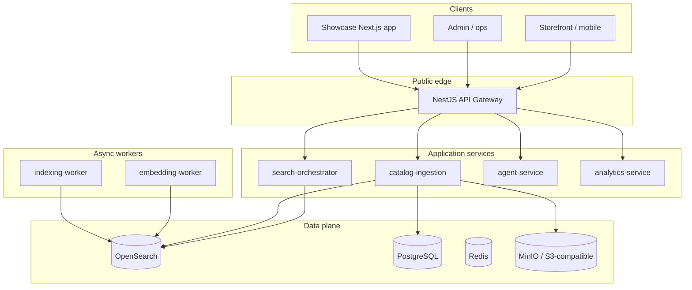

# Commerce AI — architecture & solution design

**Status:** Reflects the current monorepo as a **Milestone 0–1** platform: public **OpenAPI** contract, **NestJS** edge gateway, **FastAPI** domain services, **OpenSearch** retrieval, **Postgres** job/metadata plane, **Redis** queues, **MinIO** (S3-compatible) for feed blobs. The **showcase** Next.js app can run **offline** (bundled demo catalog + optional LLM intent) or **online** (proxy to gateway).

**Canonical API:** [`contracts/openapi.yaml`](../contracts/openapi.yaml).

---

## 1. Goals

- **Hybrid search**: combine lexical precision with semantic retrieval (weights and embeddings evolve per roadmap in [TECHNICAL_PRD.md](../TECHNICAL_PRD.md)).
- **Multi-tenant commerce**: isolate tenants logically (mandatory `tenant_id` on documents and queries); shared physical indexes are the default posture.
- **Feed-based ingestion**: merchants upload **`*.csv.gz`** via presigned object storage → async jobs → bulk index.
- **Extensibility**: retrieval engine behind **`SearchEngineAdapter`** (today: OpenSearch); future adapters (e.g. Vespa, vector DB) without changing integrators if the gateway contract stays stable.

---

## 2. High-level system context

Integrators (web, mobile, partner systems) speak **HTTPS + JSON** to the **API gateway**. The gateway authenticates (see [SECURITY_ARCHITECTURE.md](./SECURITY_ARCHITECTURE.md)) and proxies to internal services. Background workers hydrate **OpenSearch** from **canonical product documents**.

**Showcase nuance:** when `COMMERCE_GATEWAY_URL` is unset, the showcase serves **`POST /api/search`** from an embedded **JSON** catalog (build-time CSV → JSON) and may call **external LLM APIs** for query interpretation only—this path does **not** replace OpenSearch for production recall at scale.

---

## 3. Component responsibilities

| Component | Technology | Responsibility |
|-----------|------------|----------------|
| **api-gateway** | NestJS | Single public HTTPS surface; API key guard; reverse proxy to FastAPI bases configured by env vars ([README](../services/api-gateway/README.md)). |
| **search-orchestrator** | FastAPI | Hybrid search orchestration; implements **`SearchEngineAdapter`**; facets, filters, query parsing scaffolding. |
| **catalog-ingestion** | FastAPI | Presign/import orchestration; jobs in Postgres; streams **`csv.gz`** to canonical docs and bulk index (embedded or standalone worker). |
| **agent-service** | FastAPI | Conversational/API “agent” surface over shared retrieval primitives (roadmap-heavy). |
| **analytics-service** | FastAPI | Event ingestion endpoint (`/v1/analytics/events`) for behavioral signals. |
| **embedding-worker** / **indexing-worker** | Python | Embedding generation and indexing sidecars (per service READMEs). |
| **OpenSearch** | Cluster | Primary search index; index template under [`configs/opensearch`](../configs/opensearch/). |
| **PostgreSQL** | RDBMS | Tenants/API keys (target), **`index_jobs`**, feed metadata. |
| **Redis** | Queue / cache | Job fan-out / transient state (per deployment). |
| **MinIO** | Object storage | Holding tank for gzipped CSV before ingest. |

**Shared Python settings:** [`services/shared-python`](../services/shared-python/).

---

## 4. Core domain abstractions

- **Canonical product document**: bilingual fields (`title`, `description`, `search_text`), structured `attrs`, `pricing`, images, optional `embedding`, **`tenant_id`**. Produced from merchant CSV via [`canonical.py`](../services/catalog-ingestion/catalog_ingestion/canonical.py) (reference implementation).

- **`SearchEngineAdapter`**: abstraction for `ping`, `hybrid_search`, `index_bulk`, `delete_by_tenant`, `facet_aggs`. Current implementation targets **OpenSearch**.

- **Tenant isolation**: shared index with enforced **`tenant_id`** filter in queries and index mappings (see PRD + OpenSearch template).

---

## 5. Primary request flows

### 5.1 Search (`POST /v1/search`)

1. Client → Gateway with `Authorization: Bearer <api_key>` and JSON body (`tenantId`, `query`, optional filters/context).
2. Gateway → **search-orchestrator** `/v1/search`.
3. Orchestrator resolves tenant config (future), executes hybrid plan, queries **OpenSearch**, returns ranked hits + facets.

### 5.2 Catalog ingest (presigned upload)

1. `POST /v1/admin/feeds/presign` → gateway → **catalog-ingestion** mints PUT URL + object key.
2. Client **direct PUT** to object storage (**browser/server does not proxy multi-GB files through the gateway**).
3. `POST /v1/admin/feeds/import` enqueues job; worker streams gzip, maps rows → canonical docs, bulk-indexes.
4. Poll `GET /v1/admin/feeds/jobs/{jobId}` until completion.

### 5.3 Showcase offline path

1. CI/Vercel **prebuild** may fetch `SHOWCASE_CATALOG_URL`, stream CSV → `demo-catalog.json` ([DEPLOYMENT_SHOWCASE.md](../DEPLOYMENT_SHOWCASE.md)).
2. Runtime **`POST /api/search`** reads JSON + optional LLM-derived filters; optionally fuses lexical-only lane—**bounded** by serverless memory and artifact size caps.

---

## 6. Deployment topologies

| Topology | Gateway + data plane | Showcase |
|----------|-------------------------|----------|
| **Local dev** | Docker Compose (`infra/docker/docker-compose.yml`) + processes per port | `pnpm showcase:dev` |
| **Hybrid (recommended pilot)** | Gateway + OpenSearch stack on VM/k8s/managed SaaS | Vercel static/serverless pointing at **HTTPS gateway** |
| **Full SaaS-style** | Multi-region gateway, managed OpenSearch, managed Postgres | Customer UI uses SDK or REST only |

The **NestJS gateway** should be the only asset requiring a **public ingress** from the storefront; databases and OpenSearch typically sit on private networks.

---

## 7. Contract-first evolution

All public routes are enumerated in **`contracts/openapi.yaml`**. TypeScript types are generated via `pnpm types:generate` into [`packages/shared-type`](../packages/shared-types/).

**Integration rule:** Breaking changes require OpenAPI semver + consumer communication; additive fields are preferred.

---

## 8. Roadmap anchors (non-exhaustive)

See [TECHNICAL_PRD.md](../TECHNICAL_PRD.md) for milestone acceptance criteria: query embeddings fusion, hardened multi-tenant key resolution, admin console, richer analytics persistence, reranking.
