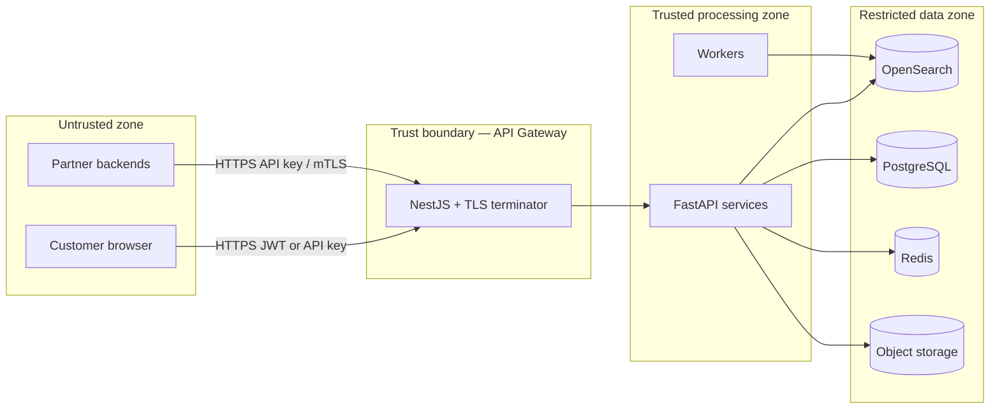

# Commerce AI — security architecture

This document describes **security-relevant behavior** as implemented today (scaffold / early production posture) and the **recommended hardening target** before handling real PII-heavy workloads or regulated data.

**Related:** [ARCHITECTURE.md](./ARCHITECTURE.md), gateway [`ApiKeyGuard`](../services/api-gateway/src/auth/api-key.guard.ts), [OpenAPI](../contracts/openapi.yaml).

---

## 1. Threat model overview

| Concern | Today (repo) | Target state |
|---------|---------------|--------------|
| **Caller authentication** | `ApiKeyGuard`: Bearer tokens must start with `pk_` or `sk_`; **`COMMERCE_AI_DEV_MODE=true`** allows missing auth | Hashed **`api_keys`** in Postgres, revoke/rotate, per-tenant issuance, optional mTLS / JWT for trusted services |
| **Authorization** | Stub maps any valid key shape to **`tenant_stub`** — **caller-supplied `tenantId` must not be trusted** for isolation until DB-backed binding | Resolve tenant **only** from authenticated principal; ignore or cross-check body `tenantId` |
| **Transport** | Assumed HTTPS at public boundary | TLS 1.2+, HSTS at edge, TLS to OpenSearch/datastores where supported |
| **Tenant isolation** | Document-level `tenant_id` + query filters (orchestrator) | Automated tests + infra policies preventing cross-tenant reads/writes |
| **Presigned uploads** | Time-limited PUT URLs (design); keys scoped to object prefix | Short TTL, least-privilege IAM, virus scanning pipeline (optional), size quotas |
| **Secrets** | Env vars locally / platform secrets in prod | KMS/Vault rotation; **no secrets in client bundles** except public anon keys |
| **OpenSearch (local compose)** | `DISABLE_SECURITY_PLUGIN: "true"` | **Never** for internet-facing; enable security plugin, fine-grained access, private networking |
| **LLM integrations (showcase)** | API keys server-side only on Vercel | Budget caps, egress allowlists, prompt/log redaction |

---

## 2. Trust boundaries

- **Untrusted**: anything that runs on an end-user device or an unvetted partner process.
- **Edge**: terminates TLS, authenticates callers, strips/normalizes unsafe headers **before** fan-out (extend as needed—do not blindly forward arbitrary headers to internal services unless allowlisted).

---

## 3. Authentication & session model

### 3.1 API keys (platform integrators)

- Header: **`Authorization: Bearer <token>`** (see OpenAPI responses `401 Unauthorized`).
- **Current guard** validates **format only** (`pk_`/`sk_` prefix) plus dev bypass ([source](../services/api-gateway/src/auth/api-key.guard.ts)).

**Operational guidance:**

- Rotate keys on compromise; partition **publishable** (`pk_`) vs **secret** (`sk_`) usage if extended beyond stub.
- Log **authenticated tenant id**, not raw keys.
- Rate-limit per key at edge (CDN/WAF/API gateway)—not implemented in scaffold.

### 3.2 Showcase / demo

- Vercel **environment variables** hold LLM keys; never expose in client bundles.
- `GET /api/health` exposes **whether** gateways/LLMs are configured—acceptable for demos; remove or redact in strict environments.

---

## 4. Authorization & multi-tenancy

**Risk:** If `tenantId` in JSON is honored without binding to the credential, **tenant A can query tenant B**.

**Mitigation path:**

1. Resolve `tenant_id` from **verified** API key / JWT claims.
2. Orchestrator **injects** tenant filter; **rejects** mismatched body `tenantId` or overwrites it server-side.
3. Add integration tests that attempt cross-tenant reads.

Index design already anticipates **shared physical index** with mandatory `tenant_id` filter—security depends on **query construction**, not index silos alone.

---

## 5. Data protection

| Data class | At rest | In transit | Notes |
|------------|---------|------------|-------|
| Catalog content (PII in descriptions) | OpenSearch + object storage | TLS | Classify per merchant; consider field-level redaction in logs |
| API keys | Env / secrets manager (target: hashed in DB) | TLS only | Never log full key |
| Analytics events | Postgres / analytics store | TLS | Minimize payloads; GDPR-style retention policies |
| Build artifacts (`demo-catalog.json`) | Git **excluded** for large CSV; Vercel build output | HTTPS to edge | Prefer presigned fetch + ephemeral build FS |

---

## 6. Ingest security

- **Presigned PUT**: limits exposure versus proxying multipart uploads through the gateway—**correct pattern** for multi-GB files.
- **Content validation**: gzip + CSV parsing should enforce **schema**, **maximum row**, and **sanitize** malformed rows to prevent injection into search templates (risk is mostly availability / relevance, not RCE—still validate).
- **Worker identity**: ingestion workers should use **least-privilege** credentials to OpenSearch (write index only) and Postgres (job queues only).

---

## 7. Dependency & supply chain

- Pin images (OpenSearch/Postgres/Redis/MinIO) in production manifests.
- Run **`npm audit` / CVE scans** on schedule; prioritize gateway and showcase (internet-exposed paths).
- **OpenSearch**: disable anonymous admin in anything connected to hostile networks.

---

## 8. Incident response checklist (minimal)

1. Rotate API keys / LLM keys; invalidate presigned URLs via storage policy where possible.
2. Block abusive IPs at edge.
3. Reindex / delete-by-tenant if poisoned documents detected.
4. Preserve audit logs from gateway and orchestrator correlating `request_id`.

---

## 9. Compliance positioning (informative only)

Commerce search rarely processes payment PANs **inside** this platform if checkout stays with PSPs—still, **merchant data processing agreements** govern catalog content.

Map controls to customer frameworks (SOC2 ISO27001 GDPR) via: encryption in transit, access logging, backups, DPIA where LLMs process personal data in queries.
